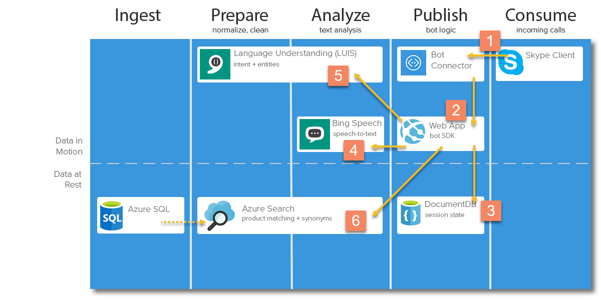

# About this repo
* Maintainer: Chris Stone (chstone@microsoft.com)
* Project: Call-Center Automation (Solution How-to Guide)
* Use case: Provide an Interactive Voice Response (IVR) bot to process product orders for a fictitious company that sells bicycles and bicycle accessories.

## Table of Contents

<!-- toc -->
- [Architecture](#architecture)
- [Build](#build)
- [Deployment](#deployment)
  * [Deploy Azure Resources](#deploy-azure-resources)
  * [Configure Azure Resources](#configure-azure-resources)
  * [Automated ARM Deployment](#automated-arm-deployment)
- [Usage](#usage)
- [Scaling](#scaling)
- [Customization](#customization)
  * [Identify custom entities (LUIS)](#identify-custom-entities-luis)
  * [Using entities with search (LUIS & Azure Search)](#using-entities-with-search-luis--azure-search)
  * [Identify common synonyms (Azure Search)](#identify-common-synonyms-azure-search)
  * [Data Wrangling (SQL Server)](#data-wrangling-sql-server)
- [Copyright](#copyright)
- [License](#license)
<!-- tocstop -->

# Architecture


* [Bot Framework](https://docs.botframework.com/en-us/skype/calling/) with [Skype Calling](https://docs.botframework.com/en-us/skype/calling/) channel  
Routes calls to the bot
* [Bing Speech Service](https://docs.microsoft.com/en-us/azure/cognitive-services/speech/home)    
Processes speech-to-text
* [LUIS](https://www.luis.ai/) (Language Understanding Intelligent Service)  
Extracts intent and entities from text
* [Azure Search](https://docs.microsoft.com/en-us/azure/search/)  
Indexes the product catalog for product-query matching
* [Azure SQL](https://docs.microsoft.com/en-us/azure/sql-database/)  
Stores product and order data
* [DocumentDB](https://docs.microsoft.com/en-us/azure/documentdb/)  
Stores bot state and event logs
* [Azure Storage](https://docs.microsoft.com/en-us/azure/storage/)  
Stores bot audio data for debugging
* [Azure App Services](https://docs.microsoft.com/en-us/azure/app-service/)  
Hosts the bot application

# Build
> Build environment should have the [latest NodeJS runtime](https://nodejs.org/en/download/current/). Recommended latest release of v7.

From the root of this repo:
1. `npm install`
1. `npm run build`
1. Copy `package.json`, `web.config`, and `data` to `dist`
1. `cd dist`
1. `npm install --production`

## Test
To run unit tests, run `npm test`

# Deployment

> [Automated ARM deployment](#automated-arm-deployment) is also available

## Deploy Azure Resources
Create the following resources using the [Azure Portal](https://portal.azure.com/), [PowerShell](https://docs.microsoft.com/en-us/powershell/azure/install-azurerm-ps?view=azurermps-3.8.0), or [Azure CLI](https://docs.microsoft.com/en-us/cli/azure/install-azure-cli).
> Unless otherwise noted, use any configuration and scale parameters you like
* `Azure Storage`
* `DocumentDB` (*without* Mongo)
* `Azure SQL` (*with* AdventureWorksLT sample DB)
* `Azure Search`
* `Azure App Service`
* `Cognitive Service` keys
  * Key for `Bing Speech API`
  * Key for `Language Understanding Intelligent Service (LUIS)`

## Configure Azure Resources

### Register your bot
1. Register a new bot at the [Bot Framework Portal](https://dev.botframework.com/bots/new)
1. Create a new Microsoft App, and make note of its **ID** and **Secret**
1. Leave the messaging endpoint blank for now
1. After your bot is registered, click through to its Skype Channel and ensure that **Skype Calling is enabled**. Your calling endpoint is `https://YOUR_WEB_APP.azurewebsites.net/api/calling`

> See guided screenshots for [bot registration](./docs/Bot-Registration.md) and [enabling Skype Calling](./docs/Enable-Skype-Calling.md)

### Find your LUIS programmatic key
1. Log in to the [LUIS Portal](https://www.luis.ai/)
1. Navigate to the `My Keys` tab
1. Make a note of your `Programmatic API Key`

> See guided screenshots for finding the [LUIS programmatic key](./docs/LUIS-Programmatic-Key.md)

### Azure App Service Application Settings
Create the following application settings on your Web App:
> Learn how to configure a site's [App Settings](https://docs.microsoft.com/en-us/azure/app-service-web/web-sites-configure) using the Azure Portal
> 
> You can find all required resource keys and names (below, in **bold**) using the Azure Portal, with the exception of the LUIS Programmatic Key, which must be copied from the [LUIS Portal](https://www.luis.ai/).

| NAME | VALUE |
| ---- | ----- |
| WEBSITE_NODE_DEFAULT_VERSION | 7.7.4 |
| CALLBACK_URL | https://**YOUR_WEB_APP**.azurewebsites.net/api/calls |
| MICROSOFT_APP_ID | **YOUR_APP_ID** (GUID) |
| MICROSOFT_APP_PASSWORD | **YOUR_APP_SECRET** |
| LUIS_REGION | westus (or your region, if different) |
| LUIS_KEY | **YOUR_LUIS_KEY** |
| LUIS_MANAGER_KEY | **YOUR_LUIS_PROGRAMATIC_KEY** |
| LUIS_APP_ID | (empty) |
| SPEECH_KEY | **YOUR_SPEECH_KEY** |
| SPEECH_ENDPOINT | https://speech.platform.bing.com/recognize |
| SPEECH_REGION | (empty) |
| SEARCH_SERVICE | **YOUR_SEARCH_ACCOUNT** |
| SEARCH_KEY | **YOUR_SEARCH_KEY** |
| BLOB_ACCOUNT | **YOUR_STORAGE_ACCOUNT** |
| BLOB_KEY | **YOUR_STORAGE_ACCOUNT_KEY** |
| DDB_URL | https://**YOUR_DOCUMENTDB_ACCOUNT**.documents.azure.com:443/ |
| DDB_KEY | **YOUR_DOCUMENTDB_KEY** |
| SQL_HOST | **YOUR_AZURE_SQL_HOST** |
| SQL_USER | **YOUR_AZURE_SQL_USER** |
| SQL_PASSWORD | **YOUR_AZURE_SQL_PASSWORD** |
| SQL_DATABASE | **YOUR_AZURE_SQL_DATABASE** |
| LOG_BLOB_CONTAINER | bot-audio |
| LOG_DDB_DATABASE | bot-data |
| LOG_DDB_COLLECTION | bot-logs |
| STORE_DDB_DATABASE | bot-data |
| STORE_DDB_COLLECTION | bot-sessions |

### Deploy bot to Azure App Service
After building the project (see [build](#build)), upload the contents of `dist` to your App Service
> Learn how to upload files to a web app using [FTP and PowerShell](https://docs.microsoft.com/en-us/azure/app-service-web/scripts/app-service-powershell-deploy-ftp)
>
> You can also deploy from the command line using [WebDeploy](https://azure.microsoft.com/en-us/blog/simple-azure-websites-deployment/)

## Automated ARM Deployment
To automatically create, configure, and deploy all Azure resources at once, run the following commands in PowerShell (or use your favorite ARM deployment tool):
> You will be prompted for **three** configuration parameters. See the [Bot Registration Guide ](./docs/Bot-Registration.md) and the [LUIS Programmatic-Key Guide](./docs/LUIS-Programmatic-Key.md) if you need help finding these values.
```PowerShell
$rg = "call-center"
$loc = "eastus"
New-AzureRmResourceGroup $rg $loc
New-AzureRmResourceGroupDeployment -Name CallCenterSolution -ResourceGroupName $rg -TemplateFile .\azuredeploy.json
```

# Usage
You will use the [Skype Client](https://www.skype.com/en/download-skype/skype-for-computer/) to initiate calls to your bot (*Skype for Business is not current supported*).

> **Windows Users** may use the [App Store Client](https://www.microsoft.com/store/apps/9wzdncrfj364)

Before talking to your bot, you must add it to your Skype contacts list. You can find a link to add your bot to Skype on the [Bot Portal](https://dev.botframework.com/) under the channel listing.

> Directly add the bot to your contacts: https://join.skype.com/bot/**YOUR_APP_ID**

Using your Skype client, initiate a call to your bot and follow the prompts. You can order any product in the standard adventure works category, such as a mountain bike, fenders, or bike wash. The bot will prompt you to disambiguate product names or to choose product attributes, if necessary.

## Sample product queries
1. "mountain bike": general product category
1. "what is mountain 500?": get more information about a specific product
1. "mountain 500": specific product
1. "mountain 500 in silver": specific product with specific color
1. "bicycle for road use"
1. "extra large jersey": general product category with specific size

# Scaling
A basic deployment will scale to around 10 concurrent requests per second. Each layer of the architecture supports a separate level of concurrency, but the entire solution is bound by the narrowest pipeline of all the services. Services may be scaled **up** to support higher throughput per resource, or scaled **out** to spread throughput across multiple resources.

| SERVICE | MAX RPS PER INSTANCE | SCALE UP | SCALE OUT |
| ------- | ------------ | -------- | --------- |
| LUIS | 10 | N/A | Custom account partitioning |
| Bing Speech | 20 | N/A | Custom account partitioning |
| App Service | 100s | Add RAM/cores | Add instances |
| Search | ~60 | N/A | Add replicas |
| DocumentDB | ~10K | N/A | Add partitioning |
| Blobs | ~20K | N/A | N/A |

> **CUSTOM ACCOUNT PARTITIONING**: Per-service scale-out configuration of Bing Speech and LUIS is not available, so custom sharding/partitioning of Bing Speech and LUIS APIs must be implemented in order to distribute load between multiple accounts. To achieve this, modify the bot app to either implement round-robin service requests, or apply hash-based routing based on the caller's userID.

# Customization
This bot is tuned end-to-end to work specifically with the AdeventureWorks sample product database. In order to transition to a custom data set, some consideration must be taken to account for the format and structure of your custom data and how best to apply best practices for LUIS and Azure Search.

## Identify custom entities (LUIS)
Every domain has a different set of common entities. An entity represents a class of similar objects that are detected from raw text by LUIS. There are three main types of entity: prebuilt (cross-domain, provided by Bing), custom (learned from your labeled data), and closed-list (a static set of terms). This app uses only closed-list entities across four classes: `color`, `category`, `sex`, and `size`.

Your goal when building and training custom entities should be to identify object classes that can be used by the search engine to boost results for the specified class.

## Using entities with search (LUIS & Azure Search)
There are two approaches to using entities with search: `filtering` and `boosting`. By applying a filter, you eliminate results that do not match the entity metadata. By applying a boost, you surface matching entities to the top of the result set, but you also return non-matches, albeit with a lower score. Use a `filter` when the entity represents a broad category, or if the entity is the *only* text in the utterance. Use a `boost` when the entity is more fine-grained, or, when included with other terms, may produce 0 results.

Consider the following response from LUIS:
```JSON
{
  "query": "red bicycle",
  "entities": [
    {
      "entity": "red",
      "type": "colors",
      "startIndex": 0,
      "endIndex": 2,
      "resolution": { "values": [ "red" ] }
    }
  ]
}
```

Apply a search filter to return only matches for `red bicycle` where the color field is `red`:
```
<url>?search=red bicycle&$filter=colors/any(x: x eq 'red')
```

Or apply a boost to raise the score for the same documents (typically bringing matches to the top of the result set) *while still including other colors as well* (e.g. if `red` was not available):
```
<url>?red bicycle colors:red^2
```

> Learn more about [advanced query operators in Azure Search](https://azure.microsoft.com/en-us/blog/lucene-query-language-in-azure-search/)

## Identify common synonyms (Azure Search)
Use custom analyzers in Azure Search to enable content matching against domain-specific synonyms, or to bridge the gap between a product's written form and its spoken form. For instance, product sizes are represented in the database as `S`, `M`, `L`, and `XL`, however, when speaking, we refer to `small`, `medium`, `large`, and `extra large`. Use one or more `#Microsoft.Azure.Search.SynonymTokenFilter`s to enable matching between these different forms.

> Learn more about [creating custom analyzers in Azure Search](https://docs.microsoft.com/en-us/rest/api/searchservice/custom-analyzers-in-azure-search)

This app uses three synonym groups, so no matter how a product or attribute is spoken, it will find a match in the search index:

### Size
```JSON
[
  "S,small",
  "M,medium",
  "XL,extra large",
  "L,large"
]
```

### Product
```JSON
[
  "bike=>bicycle",
  "lady,girl=>woman",
  "guy,boy=>man",
  "clothes=>clothing",
  "hat=>cap"
]
```

### Sex
```JSON
[
  "lady,girl=>woman",
  "guy,boy=>man"
]
```

> Azure Search now supports [query-time synonym maps in public preview](https://azure.microsoft.com/en-us/blog/azure-search-synonyms-public-preview/).

## Data Wrangling (SQL Server)
Source content often is not in an ideal state for consumption by bots and search applications.
This section describes common preprocessing transformations that can be applied to source content.

### Connect to a Table or a View?
Azure Search offers a configurable `Azure SQL indexer` for no-code, automated ingest of your source content, given the name of a `table` or `view` in your database. For simple data sets, a `table` works well, but for most applications, you will want to connect to a custom `view` to account for SQL joins, predicates, and other custom result processing.
> Learn more about connecting [Azure Search and Azure SQL](https://docs.microsoft.com/en-us/azure/search/search-howto-connecting-azure-sql-database-to-azure-search-using-indexers)

### Defining a search "document"
Search documents, by nature, are denormalized (unjoined). Azure Search does not support joins, so all of the information describing a result must be attached to a single document. To achieve a high level of usability, it is critical to apply a proper denormalization strategy against your normalized (table-joined) data. Consider the following two AdventureWorks tables. Both contain product names, but the latter is has many repeated sections, varying only by a single attribute.

#### SalesLT.ProductModel
| Name |
| ---- |
| HL Road Frame |
| LL Road Frame |
| ML Road Frame |
| ML Road Frame-W |

#### SalesLT.Product
| Name |
| ---- |
| HL Road Frame - Black, 44 |
| HL Road Frame - Black, 48 |
| HL Road Frame - Black, 52 |
| HL Road Frame - Black, 58 |
| HL Road Frame - Black, 62 |
| HL Road Frame - Red, 44 |
| HL Road Frame - Red, 48 |
| HL Road Frame - Red, 52 |
| HL Road Frame - Red, 56 |
| HL Road Frame - Red, 58 |
| HL Road Frame - Red, 62 |
| ... and so on, for LL, ML, and ML-W, etc. |

If we envision each table row as a search result, it is clear that the second table will overwhelm an end user with mostly-duplicated results and lead to a poor user experience. However, the first table lacks valuable product information needed to identify a specific product SKU.

The solution is to **collapse** the information from the second table onto the first using a custom `view` and a handful of `user-defined functions`.

> Other ETL techniques may be used to massage your content. This example uses functions.

Azure Search supports the `Collection(Edm.String)` document type for storing semi-complex, searchable metadata on a document. In this case, we will define two collections: one for `color` and one for `size`. Both of these product attributes should be searchable, but, because they are attached to a parent document, they will not return a new document for every possible combination.

In order to properly prepare the values for Azure Search, we must coerce them into a JSON string. As of this writing, there is no built-in SQL functionality to achieve this, but we can apply the SQL `coalesce` operator inside a custom function to build the string:
```sql
CREATE FUNCTION ufnGetColorsJson(@productModelId int)
RETURNS nvarchar(max)
AS 
BEGIN
  DECLARE @vals AS nvarchar(max)
  SELECT
    @vals = coalesce(@vals + ',"', '"') + [t].[color] + '"'
  FROM
    (
      SELECT
        DISTINCT [color]
      FROM
        [SalesLt].[Product] [p]
      WHERE
        [p].[productModelId]=@productModelId
    ) [t]
  RETURN lower('[' + @vals + ']')
END
```

Then we create a new `view` to return the denormalized representation of our data:
```sql
CREATE VIEW [SalesLT].[vProductsForSearch]
AS
SELECT
  [pm].[name],
  [pm].[productModelId],
  [pm].[modifiedDate],
  (SELECT dbo.ufnGetColorsJson([productModelId])) [colors],
  (SELECT dbo.ufnGetSizesJson([productModelId])) [sizes]
FROM
  [SalesLt].[ProductModel] [pm]
```

> See the full view with more custom functions in this repo under `./data/sql`

Azure Search executes this view when it indexes (and periodically re-indexes) the product database.

# Copyright
©2017 Microsoft Corporation. All rights reserved. This information is provided "as-is" and may change without notice. Microsoft makes no warranties, express or implied, with respect to the information provided here. Third party data was used to generate the solution. You are responsible for respecting the rights of others, including procuring and complying with relevant licenses in order to create similar datasets.

# License
The MIT License (MIT)
Copyright (c) 2017 Microsoft Corporation

Permission is hereby granted, free of charge, to any person obtaining a copy
of this software and associated documentation files (the "Software"), to deal
in the Software without restriction, including without limitation the rights
to use, copy, modify, merge, publish, distribute, sublicense, and/or sell
copies of the Software, and to permit persons to whom the Software is
furnished to do so, subject to the following conditions:

The above copyright notice and this permission notice shall be included in all
copies or substantial portions of the Software.

THE SOFTWARE IS PROVIDED "AS IS", WITHOUT WARRANTY OF ANY KIND, EXPRESS OR
IMPLIED, INCLUDING BUT NOT LIMITED TO THE WARRANTIES OF MERCHANTABILITY,
FITNESS FOR A PARTICULAR PURPOSE AND NONINFRINGEMENT. IN NO EVENT SHALL THE
AUTHORS OR COPYRIGHT HOLDERS BE LIABLE FOR ANY CLAIM, DAMAGES OR OTHER
LIABILITY, WHETHER IN AN ACTION OF CONTRACT, TORT OR OTHERWISE, ARISING FROM,
OUT OF OR IN CONNECTION WITH THE SOFTWARE OR THE USE OR OTHER DEALINGS IN THE
SOFTWARE.
